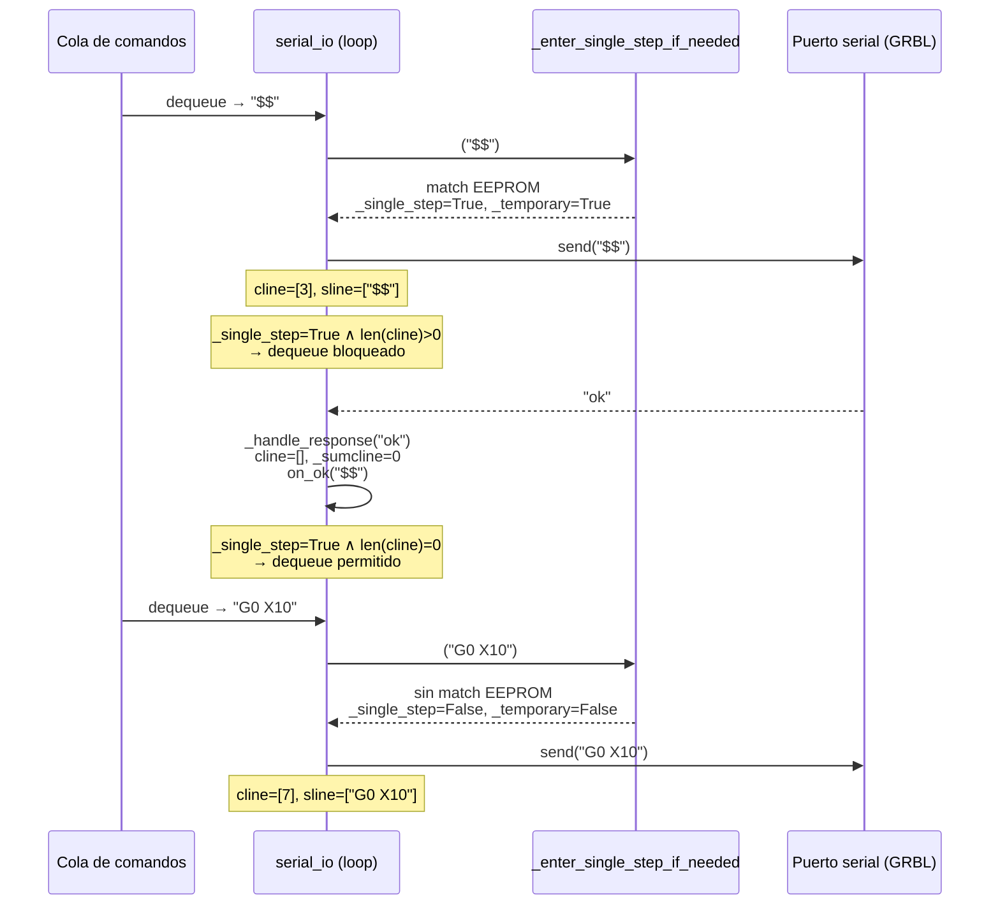

# DR 0005: Refactor del controlador GRBL

## Status

Accepted

## Date

2026-04-30

## Context and Problem

La clase `GrblController` concentra demasiadas responsabilidades:

- Gestiona el thread de I/O serial (`serial_io`)
- Mantiene la contabilidad del buffer RX de GRBL (`cline`/`sline`/`_sumcline`)
- Parsea respuestas, encola comandos
- Gestiona el proceso de inicialización y conoce la variable de entorno `GRBL_SIMULATION`

Esto dificulta el testing unitario, el mantenimiento y la extensión del código.

El repositorio de referencia _Universal G-Code Sender (UGS)_ resuelve este problema usando composición: `GrblController` delega en:

- `GrblCommunicator` (I/O puro)
- `GrblControllerInitializer` (protocolo de inicialización)
- Clases de comandos (`GetBuildInfoCommand`, `GetStatusCommand`, etc.)

Adicionalmente se identificaron dos brechas funcionales respecto a UGS:

1. **Carry-forward de WCO y overrides**: GRBL no incluye `WCO:` ni `Ov:` en cada respuesta de status.
   Si estos campos no se conservan entre polls, la posición de trabajo calculada es incorrecta y los
   overrides se pierden.
2. **Inicialización incompleta**: la configuración de GRBL (`$$`) no se solicita automáticamente al
   conectar; el consumidor debe invocar `query_grbl_settings()` manualmente.

```
Arquitectura actual
───────────────────
  GrblController
  ├── serial_io (thread I/O)
  ├── _sumcline / cline / sline
  ├── parse_response
  ├── connect / disconnect
  ├── GRBL_SIMULATION (var. entorno)
  ├── GrblStatus  ← ya extraído
  └── GrblMonitor ← ya extraído

Arquitectura propuesta
──────────────────────
  GrblController  (coordinador)
  ├── GrblCommunicator   (thread I/O puro)
  ├── GrblInitializer    (protocolo de inicialización)
  ├── GrblStatus         (estado — sin cambios)
  ├── GrblMonitor        (logging/pubsub — sin cambios)
  └── commands/          (comandos de consulta estructurada)
      ├── GetBuildInfoCommand
      ├── GetSettingsCommand
      ├── GetParserStateCommand
      └── GetStatusCommand
```

Adicionalmente se identificaron dos problemas de diseño interno que el refactor debe resolver:

3. **Sincronización con escrituras EEPROM**: ciertos comandos GRBL escriben en la flash interna del microcontrolador
   AVR (`G10`, `G28.1`, `G30.1`, coordenadas de trabajo `G54`–`G59`, escrituras de configuración `$k=v`, y consultas que
   fuerzan lectura de EEPROM: `$$`, `$#`, `$I`, `$N`, `$RST=`).
   Durante una escritura a EEPROM el firmware **no puede atender** el buffer RX: si llega un segundo comando antes del
   `ok` de confirmación, el byte se descarta o corrompe la secuencia de parsing, dejando el controlador en un estado
   inválido (buffer desincronizado, comandos perdidos).

Referencia: [GRBL wiki - EEPROM issues](https://github.com/grbl/grbl/wiki/Interfacing-with-Grbl#eeprom-issues)

4. **Acoplamiento en `parse_response`**: el método `parse_response` de `GrblController` recibe un `(msg_type, payload)`
   genérico y contiene una cadena de `if msg_type == ...` que acopla tres aspectos distintos en un mismo lugar:
    - El despacho por tipo de mensaje.
    - La acumulación de respuestas multi-línea (p. ej. `$$` genera N líneas `$k=v` + `ok`; `$I` genera
      `[VER:...]` + `[OPT:...]` + `ok`). Hoy las actualizaciones parciales se acumulan en `build_info: GrblBuildInfo`
      directamente desde el controlador, sin un objeto que marque cuándo la secuencia está completa.
    - La conversión del payload crudo a tipos de dominio (`int(payload["blockBufferSize"])`, etc.).

## Options Considered

### Separación de I/O (GrblCommunicator) y modo single-step para comandos EEPROM

**Propuesta de diseño en `GrblCommunicator`**

Se mantienen dos flags booleanos:

- `_single_step`: bloquea el desencolado mientras `cline` no esté vacío.
- `_temporary_single_step`: indica que el modo fue activado automáticamente (no por el usuario)
  y debe desactivarse en cuanto se procese un comando no-EEPROM.

Flujo de una secuencia `["$$", "G0 X10"]`:



Si el siguiente comando también fuera EEPROM, `_enter_single_step_if_needed` mantendría el
modo activo sin interrupciones.

1. **Extraer `GrblCommunicator`** con el thread `serial_io`, `cline`/`sline` y detección de comandos EEPROM.
    - Pros: alinea con UGS; `GrblController` queda como coordinador puro; facilita testing del I/O en forma
      independiente.
    - Cons: requiere refactorizar todas las referencias internas a las listas `cline`/`sline`.

2. **Mantener todo en `GrblController`**.
    - Pros: sin cambios de superficie.
    - Cons: mantiene el problema de clase monolítica; testing difícil.

### Clases de comandos

La propuesta es que cada clase de comando encapsule:

- El string del comando a enviar (e.g., `GrblCommand.BUILD.value`).
- La lógica de acumulación de respuestas hasta el `ok` final.
- La conversión del payload crudo al tipo de dominio correspondiente.
- Un callback de completado que `GrblController` registra al encolar el comando.

Esto permite que `GrblController` se limite a construir el comando, encolarlo vía
`communicator.send()`, y reaccionar al resultado sin conocer el formato de la respuesta.

**Opciones:**

1. **Solo comandos de consulta estructurada** (4 clases: `GetBuildInfoCommand`,
   `GetSettingsCommand`, `GetParserStateCommand`, `GetStatusCommand`).
    - Pros: encapsula el parsing cerca de quien produce los datos; facilita edge cases (GRBL 0.9,
      respuesta mínima `ok`); sin sobreingeniería.
    - Cons: inconsistencia con comandos de acción (`$X`, `$C`, `$H`) que permanecen como strings en el
      enum `GrblCommand`.

2. **Clase para cada comando GRBL** (incluyendo acciones).
    - Pros: consistencia total.
    - Cons: sobreingeniería para comandos que no tienen respuesta estructurada.

### GRBL_SIMULATION

1. **Parámetro `skip_startup_validation: bool`** en `GrblInitializer`.
    - Pros: desacopla la lógica de negocio de la variable de entorno; testeable sin parches de entorno.
    - Cons: el consumidor (gateway) debe pasar el parámetro al construir el inicializador.

2. **Subclase `GrblSimulationInitializer`**.
    - Pros: polimorfismo limpio.
    - Cons: complejidad innecesaria para un solo punto de variación.

3. **Mantener `if not GRBL_SIMULATION`** en `GrblController`.
    - Pros: sin cambios.
    - Cons: el acoplamiento a la variable de entorno permanece en la lógica de negocio.

### Carry-forward de WCO/overrides

1. **En `GrblStatus.update_status()`**.
    - Pros: centralizado; único punto de mantenimiento; testeable en forma aislada.
    - Cons: `GrblStatus` necesita conocer la lógica de derivación de posición.

2. **En `GetStatusCommand.parse()`**.
    - Pros: el parsing vive junto al comando que lo produce.
    - Cons: `GetStatusCommand` necesita acceso al status anterior.

## Decision

Se adoptan las opciones 1 de cada sección:

- **`GrblCommunicator`**: extrae el thread `serial_io`, `cline`/`sline`, `_sumcline`, `_empty_queue`,
  `_send_realtime`, y agrega detección de comandos EEPROM con modo single-step temporal.
- **Clases de comandos**: solo las 4 de consulta estructurada, en el subdirectorio `commands/`.
- **`GRBL_SIMULATION`**: se mantiene en `config.py` pero se pasa como parámetro `skip_startup_validation`
  al construir `GrblInitializer`; el `import GRBL_SIMULATION` se elimina de `grblController.py`.
- **`GrblInitializer`**: protocolo de 5 pasos (poll de status × 10, respuesta a HOLD/ALARM, `$I`, `$G`, `$$`).
- **Carry-forward**: implementado en `GrblStatus.update_status()`.

## Consequences

- **[+]** `GrblController` queda como un coordinador delgado; cada clase tiene una única responsabilidad.
- **[+]** El testing del I/O serial, del protocolo de inicialización, y del parsing de status se puede realizar
  de forma totalmente independiente.
- **[+]** La configuración de GRBL (`$$`) y el estado del parser (`$G`) se obtienen automáticamente al conectar.
- **[+]** La posición de trabajo y los overrides se calculan correctamente entre polls que no incluyen `WCO:` ni `Ov:`.
- **[+]** Los comandos que escriben EEPROM no corrompen el buffer RX gracias al modo single-step temporal en `GrblCommunicator`.
- **[-]** La superficie de la API pública aumenta (3 nuevas clases + 4 comandos
    - 5 pasos de inicialización); la curva de aprendizaje para nuevos colaboradores es algo mayor.
- **[-]** Los tests existentes de `serial_io` y `connect` deben migrarse a los nuevos archivos de test.

## Responsibility Distribution

La siguiente tabla delimita explícitamente las responsabilidades de cada clase:

| Clase                  | Responsabilidades                                                                                                                                                                                                                                                                                                                                                                            |
| ---------------------- | -------------------------------------------------------------------------------------------------------------------------------------------------------------------------------------------------------------------------------------------------------------------------------------------------------------------------------------------------------------------------------------------- |
| **`GrblCommunicator`** | Ciclo de vida del thread I/O (`start`/`stop`). Contabilidad del buffer RX (`cline`/`sline`/`_sumcline`). Detección de comandos EEPROM y modo single-step. Parsing de cada línea recibida (`GrblLineParser`). Dispatch de callbacks semánticos (`on_ok`, `on_error`, `on_alarm`, `on_message`, `on_program_end`, `on_disconnect`). API de escritura (`send`, `send_realtime`, `empty_queue`). |
| **`GrblInitializer`**  | Protocolo de startup en 3 pasos: (1) lectura y validación del mensaje de bienvenida (`read_startup`), (2) lectura del mensaje opcional de alarma post-startup (`handle_post_startup`), (3) encolado de consultas iniciales `$I`/`$G`/`$$` (`queue_initial_queries`).                                                                                                                         |
| **`GrblStatus`**       | Estado observable del dispositivo: posición (`mpos`/`wpos`/`wco`), estado del parser modal, flags (`connected`, `paused`, `alarm`, `stop`, `finished`), error activo. Carry-forward de `wco`/`ov`/`accessoryState` entre polls. Derivación automática de `mpos`↔`wpos` a partir de `wco`.                                                                                                    |
| **`GrblMonitor`**      | Adaptador de logging: formatea y emite eventos seriales (`sent`, `received`) y mensajes de nivel `debug`/`info`/`warning`/`error`/`critical`). Desacoplado de los detalles de la comunicación serial.                                                                                                                                                                                        |
| **`GrblController`**   | Coordinador de ciclo de vida (`connect`/`disconnect`). Construcción y cableado de `GrblCommunicator`, `GrblInitializer` y `GrblStatus`. Recepción de callbacks semánticos del comunicador y actualización del estado observable. API pública de acciones: `send_command`, `jog`, `set_settings`, `queryStatusReport`, `disable_alarm`, etc.                                                  |

**Regla de dependencias** (las flechas indican "depende de"):

```
GrblController
  → GrblCommunicator  → GrblStatus, GrblMonitor, SerialService
  → GrblInitializer   → GrblCommunicator, GrblMonitor, SerialService
  → GrblStatus
  → GrblMonitor
```

Ninguna clase de infraestructura (`GrblCommunicator`, `GrblInitializer`, `GrblStatus`, `GrblMonitor`) depende de
`GrblController`, lo que permite instanciarlas y testearlas de forma completamente independiente.

## Next Steps

1. Crear `GrblCommunicator` en `src/core/core/utilities/grbl/grblCommunicator.py`.
2. Crear clases de comandos en `src/core/core/utilities/grbl/commands/`.
3. Crear `GrblInitializer` en `src/core/core/utilities/grbl/grblInitializer.py`.
4. Actualizar `GrblStatus.update_status()` con carry-forward de WCO/overrides.
5. Simplificar `GrblController` para delegar en las nuevas clases.
6. Migrar y ampliar los tests correspondientes.
